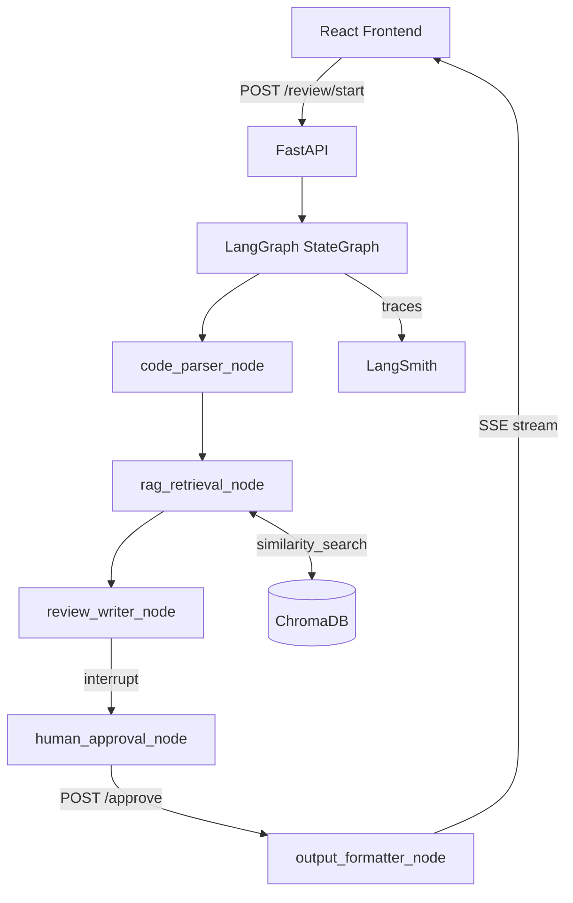

# AI Code Review Agent

> A production-grade fullstack multi-agent system built with **LangGraph**, **LangChain**, **LangSmith**, **FastAPI**, and **React**.

## What It Does

A developer pastes code into the React frontend. A five-node LangGraph workflow autonomously:
1. **Parses** the code (language detection, structure extraction)
2. **Retrieves** relevant coding standards from ChromaDB via RAG
3. **Writes** a structured markdown review using GPT-4o
4. **Pauses** for **Human-in-the-Loop** approval (`interrupt()`)
5. **Formats** the final output and streams it back via SSE

## Architecture



## Tech Stack

| Layer | Technology |
|-------|-----------|
| Frontend | React 18 + Vite + TypeScript + TailwindCSS |
| API | FastAPI + Pydantic v2 + SSE |
| Agent Pipeline | LangGraph StateGraph + LangChain |
| Vector Store | ChromaDB (local) |
| LLM | OpenAI GPT-4o |
| Observability | LangSmith |

## Local Setup

### Prerequisites
- Python 3.11+
- Node.js 20+
- OpenAI API key
- LangSmith API key (free at [smith.langchain.com](https://smith.langchain.com))

### 1. Clone & configure

```bash
git clone https://github.com/YOUR_USERNAME/ai-code-review-agent
cd ai-code-review-agent
cp .env.example .env
# Edit .env with your real API keys
```

### 2. Backend

```bash
cd backend
python -m venv .venv
.venv\Scripts\activate          # Windows
# source .venv/bin/activate     # macOS/Linux

pip install -r requirements.txt

# Populate ChromaDB with coding standards (run once)
python -m app.rag.ingest

# Start the API server
uvicorn main:app --reload --port 8000
```

### 3. Frontend

```bash
cd frontend
npm install
npm run dev
```

Open [http://localhost:5173](http://localhost:5173)

### 4. Docker (full stack)

```bash
docker compose up --build
```

## Running Tests

```bash
cd backend
pytest tests/ -v --cov=app
```

## LangSmith Observability

Every agent run is fully traced. Set `LANGCHAIN_TRACING_V2=true` and `LANGCHAIN_API_KEY` in your `.env`. Traces appear at [smith.langchain.com](https://smith.langchain.com) under the project `ai-code-review-agent`.

## Human-in-the-Loop Flow

1. `POST /review/start` — graph runs through `review_writer`, then **pauses** at `human_approval` via `interrupt()`
2. The draft review is returned to the UI
3. User clicks **Approve** or **Request Changes**
4. `POST /review/{thread_id}/approve` — graph **resumes**, runs `output_formatter`
5. `GET /review/{thread_id}/stream` — SSE streams the final review word by word

## Project Structure

```
├── backend/
│   ├── app/
│   │   ├── agents/         # LangGraph nodes (one file per node)
│   │   ├── graph/          # StateGraph definition and ReviewState TypedDict
│   │   ├── api/            # FastAPI routes and Pydantic schemas
│   │   ├── rag/            # ChromaDB vector store and ingestion script
│   │   └── core/           # Config (pydantic-settings) and logging
│   ├── tests/              # Pytest unit tests
│   └── main.py             # FastAPI entrypoint
├── frontend/
│   └── src/
│       ├── components/     # Reusable React components
│       ├── hooks/          # useReview, useSSE custom hooks
│       ├── pages/          # ReviewPage
│       ├── api/            # Axios wrappers
│       └── types/          # TypeScript interfaces
├── docker-compose.yml
└── .env.example
```
